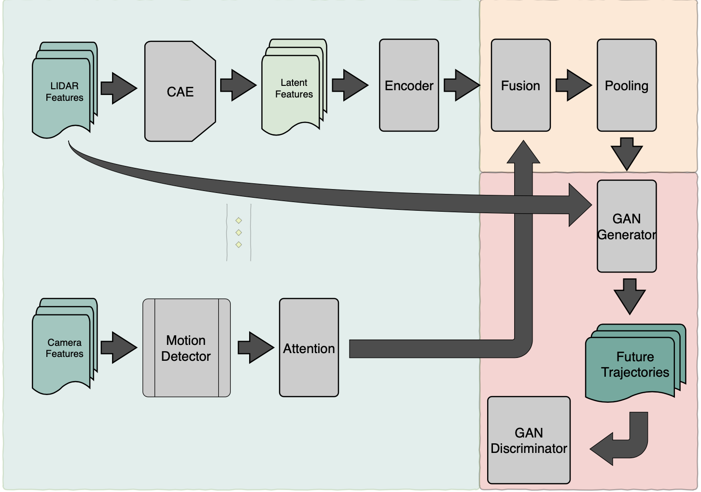

# SAS-GAN: Self-Attention Social GAN

To assure the safety of humans in an environment shared with machines, it is a necessity for machines to first understand human behavior and then based on this understanding, prevent fatal accidents by predicting future movements of humans.
SAS-GAN is an attempt to tackle the challenge of understanding the human driving behaviors.
The aim of this post is to gather all information about sasgan in one place.
The sasgan architecture consists of two separate networks, the first one is responsible for transforming all the features in to a unified latent feature space. Exerting the first network, the second network is responsible to generate plausible trajectories.


<div align="center">
    
    <figcaption>Figure 1: Overview of SAS-GAN architecture. It consists of three parts: feature extractor,
social pooling, and generato </figcaption>
</div>


## Tutorial on how to use the logger class: 
I have to recall that this class works with tensorboard and is independant of the python logger package.


### functions: 
On any part of your modules, if you need to plot or visualize any tensor or image use
the implemented functions in this class.
1. scalar_suammary:

```python
num_steps = 40
tensorflow_logger = Logger()
for step in range(num_steps):
    torch_scalar = np.random.random()
    tensorflow_logger.scalar_summary("Some random value", torch_scalar, step)
```

2. image_summary:

```python
mnist = sklearn.datasets.load_digits()
train = mnist["data"]
print(train.shape)
tensorflow_logger.image_summary("MNIST dataset", train[0].reshape((-1, 8, 8, 1)))

# Testing the image_summary with many input images
tensorflow_logger.image_summary("MNIST dataset many", train[0:5].reshape(-1, 8, 8, 1))
```

3. figure_summary:
```python
figure = plt.figure()
plt.subplot(2, 2, 1)
plt.imshow(train[0].reshape((8, 8)), cmap="gray"), plt.xticks([]), plt.yticks([]), plt.title("1")

plt.subplot(2, 2, 2)
plt.imshow(train[1].reshape((8, 8)), cmap="gray"), plt.xticks([]), plt.yticks([]), plt.title("2")

plt.subplot(2, 2, 3)
plt.imshow(train[2].reshape((8, 8)), cmap="gray"), plt.xticks([]), plt.yticks([]), plt.title("3")

plt.subplot(2, 2, 4)
plt.imshow(train[3].reshape((8, 8)), cmap="gray"), plt.xticks([]), plt.yticks([]), plt.title("4")

tensorflow_logger.figure_summary("Testing the figure", figure)
```


TODO list:
- [x] Data loader
- [ ] Visualization
- [x] Network module
- [x] Self-attention module
- [ ] ADE and FDE
- [ ] Train loop
- [ ] Test loop

